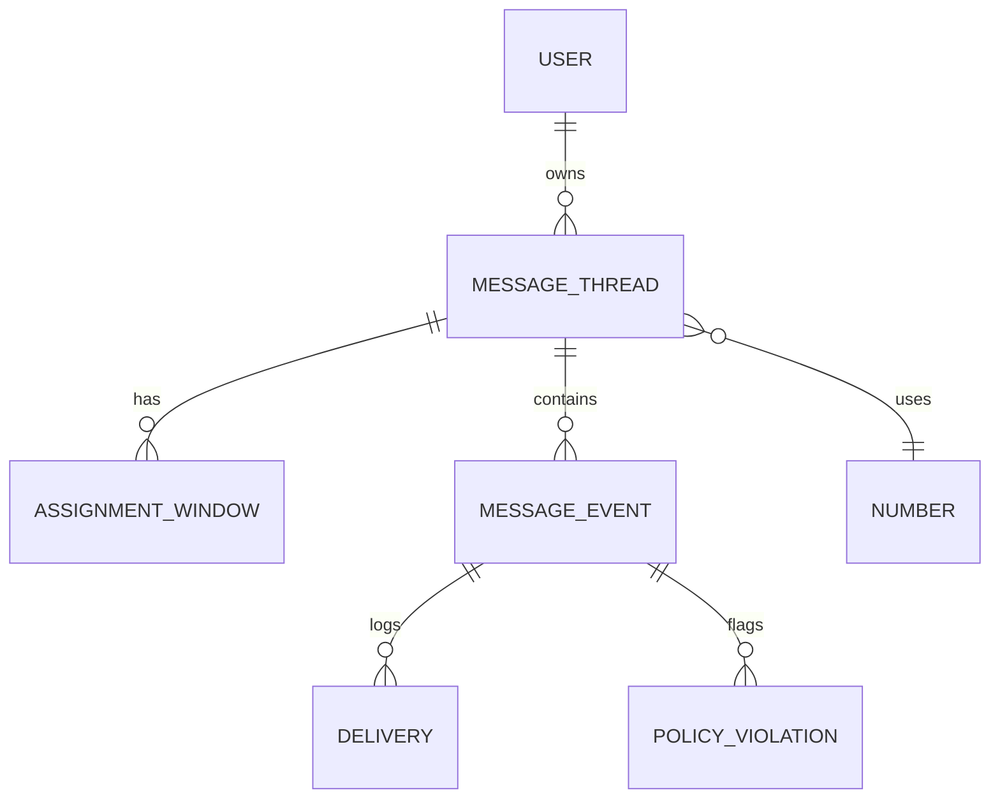

# Snout OS Messaging Executive Summary

## Executive Summary
This report specifies an enterprise-grade messaging system for Snout OS. The codebase already includes messaging routes and components; this document reorganizes them into a cohesive design where all message-related features (Inbox, Numbers, Assignments, Setup) live under a unified Messaging tab in the main navigation. The system covers Prisma data models, APIs, Zod schemas, routing and policy rules, Twilio integration, delivery tracking, and operational scale for 1k+ clients. Acceptance tests, diagrams, and verification steps ensure the system is fully covered.

## 1. Data Models and Architecture

### User
- Purpose: Authenticated actor (owner or sitter).
- Fields: `id`, `name`, `email`, `role` (enum: `owner` | `sitter`).
- Success modes: Session includes role and sitterId; owner routes see full messaging UI.
- Failure modes: Missing role defaults to owner; sitter restrictions fail open.
- Acceptance tests:
  - Login as owner -> session contains `role=owner`, `/messages` accessible.
  - Login as sitter -> session contains `role=sitter`, `/messages` redirects to `/sitter/inbox`.

### MessageThread
- Purpose: A conversation container that holds client messaging history and routing context.
- Fields: `id`, `clientName`, `clientE164`, `messageNumber`, `ownerId`, `sitterId`,
  `ownerUnreadCount`, `hasPolicyViolation`, `hasDeliveryFailure`, `lastActivityAt`.
- Success modes: Thread resolves by (From, To) for inbound; created on first message.
- Failure modes: Missing number assignment routes to owner; thread stays accessible.
- Acceptance tests:
  - Inbound POST creates or updates a thread and increments `ownerUnreadCount`.
  - GET `/api/messages/threads?inbox=owner` shows latest `lastActivityAt`.

### MessageEvent
- Purpose: Individual SMS event stored on a thread.
- Fields: `id`, `threadId`, `from`, `to`, `body`, `redactedBody`, `direction`, `createdAt`.
- Success modes: Inbound/outbound stored; `redactedBody` set on policy violation.
- Failure modes: Inbound without thread uses fallback number; event still stored.
- Acceptance tests:
  - GET `/api/messages/threads/{id}/messages` returns event list ordered by time.

### Delivery
- Purpose: Tracks outbound delivery status.
- Fields: `id`, `messageId`, `status`, `providerMessageId`, `channel`, `attemptNo`,
  `errorCode`, `errorMessage`.
- Success modes: Status updates via callbacks to `delivered` or `failed`.
- Failure modes: Missing callback retains `queued` or `sent`.
- Acceptance tests:
  - POST `/api/messages/{messageId}/retry` creates `attemptNo + 1`.

### PolicyViolation
- Purpose: Flags disallowed content (anti-poaching, contacts, links).
- Fields: `id`, `messageId`, `type`, `severity`, `isRedacted`, `details`.
- Success modes: Violations stored and message redacted for sitters.
- Failure modes: Detection fails open with audit log.
- Acceptance tests:
  - Policy violation marks thread `hasPolicyViolation=true`.

### AssignmentWindow
- Purpose: Time window when a sitter is assigned to a thread.
- Fields: `id`, `threadId`, `sitterId`, `startAt`, `endAt`.
- Success modes: Routing honors active window; sitter compose enabled only inside.
- Failure modes: Overlapping windows rejected with validation error.
- Acceptance tests:
  - POST `/api/assignments/windows` with invalid window returns 400.

### Number
- Purpose: Inventory of business phone numbers.
- Fields: `id`, `e164`, `type`, `status`, `assignedToUserId`, `assignedToThreadId`, `createdAt`.
- Success modes: Active numbers can be used for outbound; quarantined numbers cannot.
- Failure modes: Release removes webhooks and routing for that number.
- Acceptance tests:
  - POST `/api/numbers/{id}/quarantine` moves status to `quarantined`.

### Entity Relationship (ERD)


## 2. Auth and Access Control
- NextAuth (Auth.js) uses Prisma.
- JWT and session callbacks set `session.user.role = token.role`.
- Middleware enforces access:
  - Owners can see Dashboard, Messaging, Numbers, Assignments, Setup.
  - Sitters see only `/sitter/inbox` and sitter-scoped APIs.

## 3. Twilio Integration

### Connect and Test
- Setup UI accepts Account SID and Auth Token.
- POST `/api/setup/provider/test` verifies credentials.
- POST `/api/setup/provider/connect` stores encrypted provider config.

### Webhook Installation
- POST `/api/setup/webhooks/install` sets `SmsUrl=/api/messages/incoming`.
- Status callback URL is also set.
- GET `/api/setup/webhooks/status` confirms provisioning.

### Inbound SMS Handling
Twilio POSTs to `/api/messages/incoming`:
1. Resolve or create thread by (From, To); set `messageNumber`.
2. Persist `MessageEvent`; apply policy checks and store `PolicyViolation`.
3. Route: if active assignment window exists, set sitterId; else route to owner.
4. Return empty `<Response/>`.

### Outbound SMS Handling
UI send flow:
1. POST `/api/messages/threads/{id}/messages` with `{ body }`.
2. Server checks role and active window; then calls Twilio API.
3. Responds 201 with new `MessageEvent` and `Delivery` status `queued`.
4. Twilio status callbacks POST `/api/messages/status` and update `Delivery.status`.
5. Failure sets `hasDeliveryFailure=true`; UI shows Retry.
6. Retry uses POST `/api/messages/{messageId}/retry` and increments `attemptNo`.

## 4. Phone Number Management and Lifecycle

### Messaging > Numbers
- GET `/api/numbers` -> `{ numbers: [NumberSchema], pagination }`
- Table columns: E.164, Type, Status, Assigned, Actions
- Filters: type and status

### NumberSchema (Zod)
```ts
const NumberSchema = z.object({
  id: z.string().uuid(),
  e164: z.string(),
  type: z.enum(["frontDesk", "pool", "sitter"]),
  status: z.enum(["active", "quarantined", "released"]),
  assignedToUserId: z.string().nullable(),
  assignedToThreadId: z.string().nullable()
});
```

### Buy and Import
- Search available numbers: GET `/api/numbers/search?region=...`
- Buy: POST `/api/numbers/buy` with `{ e164 }`
- Import existing: POST `/api/numbers/import` with `{ e164 | sid }`

### Assign, Quarantine, Release
- Assign sitter number: POST `/api/numbers/{id}/assign`
- Quarantine: POST `/api/numbers/{id}/quarantine` removes webhooks
- Release: POST `/api/numbers/{id}/release` re-enables or deletes

### Lifecycle Models
| Aspect | Model A (Bind-until-Inactive) | Model B (Timed Expiry, 72h) | Recommendation |
| --- | --- | --- | --- |
| Complexity | Simple | Medium (scheduler) | A |
| Reuse Efficiency | Lower reuse | Higher reuse | Depends on pool size |
| Client Experience | Stable number | Number may change | A |
| Implementation | Low effort | Medium effort | A |
| Risk | Idle cost | Message disconnect | A |

Default: Model A. Hold numbers until threads truly end, then release after long inactivity (e.g., 30 days).

## 5. Assignment Windows and Thread Routing

### Assignment APIs
- GET/POST/PUT/DELETE `/api/assignments/windows`

### WindowSchema (Zod)
```ts
const WindowSchema = z.object({
  id: z.string().uuid(),
  threadId: z.string().uuid(),
  sitterId: z.string().uuid(),
  startAt: z.string(),
  endAt: z.string()
});
```

### Routing Rules
- If now is within an active AssignmentWindow, route to sitter.
- Else route to owner.
- Thread header shows assigned sitter and window status.
- Sitter compose disabled outside window.

### Why Routed
- GET `/api/routing/threads/{id}/history` returns evaluation trace.

## 6. UI/UX: Unified Messaging Tab
- Main navigation includes a single Messaging item.
- Sub-items: Inbox, Numbers, Assignments, Setup.
- No duplicate messaging links elsewhere in the nav.

### Owner Inbox
- Split view: threads list on left, conversation on right.
- Filters: All, Unread, Policy, Failures.
- Thread rows show badges for unread, policy violation, and failure.

### Sitter Inbox
- Shows only active-window threads.
- Client real number never shown, only masked business number.
- Compose disabled outside active window.

## 7. APIs and Zod Schemas

### Setup APIs
- GET `/api/setup/provider/status`
- POST `/api/setup/provider/test`
- POST `/api/setup/webhooks/install`
- GET `/api/setup/webhooks/status`

### Number APIs
- GET `/api/numbers`
- GET `/api/numbers/search`
- POST `/api/numbers/buy`
- POST `/api/numbers/import`
- POST `/api/numbers/{id}/assign`
- POST `/api/numbers/{id}/quarantine`
- POST `/api/numbers/{id}/release`

### Assignment APIs
- GET `/api/assignments/windows`
- POST `/api/assignments/windows`
- PUT `/api/assignments/windows/{id}`
- DELETE `/api/assignments/windows/{id}`

### Messaging APIs (Owner)
- GET `/api/messages/threads?inbox=owner`
- GET `/api/messages/threads/{id}/messages`
- POST `/api/messages/threads/{id}/messages`
- POST `/api/messages/{messageId}/retry`
- GET `/api/routing/threads/{id}/history`

### Messaging APIs (Sitter)
- GET `/api/sitter/threads`
- GET `/api/sitter/threads/{id}/messages`
- POST `/api/sitter/threads/{id}/messages`

### ThreadSummary (Zod)
```ts
const ThreadSummary = z.object({
  id: z.string().uuid(),
  clientName: z.string().nullable(),
  ownerUnreadCount: z.number().int(),
  hasPolicyViolation: z.boolean(),
  hasDeliveryFailure: z.boolean(),
  messageNumber: z.string(),
  sitterAssigned: z.boolean(),
  assignmentStatus: z.string(),
  lastActivityAt: z.string()
});
```

### MessageSchema (Zod)
```ts
const MessageSchema = z.object({
  id: z.string().uuid(),
  from: z.string(),
  to: z.string(),
  body: z.string(),
  redactedBody: z.string().nullable(),
  createdAt: z.string(),
  deliveries: z.array(z.object({
    providerMessageId: z.string(),
    status: z.enum(["queued", "sent", "delivered", "failed"]),
    channel: z.string(),
    attemptNo: z.number(),
    errorCode: z.number().nullable(),
    errorMessage: z.string().nullable()
  })),
  policyViolations: z.array(z.object({
    type: z.string(),
    severity: z.enum(["warning", "block"]),
    isRedacted: z.boolean(),
    details: z.string().nullable()
  }))
});
```

## 8. Acceptance Tests (Examples)
- Navigation: Clicking Messaging opens the Inbox. Numbers, Assignments, Setup are under Messaging only.
- Inbox List: GET `/api/messages/threads?inbox=owner` returns 200 and thread summaries.
- Open Thread: GET `/api/messages/threads/{id}/messages` returns 200 and renders chat UI.
- Send and Retry: POST `/api/messages/threads/{id}/messages` returns 201; failed messages show Retry -> POST `/api/messages/{messageId}/retry`.
- Role Flow: Sitters see only `/sitter/inbox`; owner routes are blocked.
- Evidence: capture screenshots, network logs (URLs and JSON), and commit SHAs.

## 9. Verification Checklist (Markdown)
```markdown
# Snout OS Messaging Verification Checklist

## Setup and Twilio
- [ ] Test Connection: POST `/api/setup/provider/test` returns 200.
- [ ] Install Webhooks: POST `/api/setup/webhooks/install` returns 200.
- [ ] Webhook Status: GET `/api/setup/webhooks/status` returns verified.

## Unified Messaging Tab
- [ ] Only one Messaging menu exists (Inbox, Numbers, Assignments, Setup).
- [ ] No duplicate messaging links elsewhere.

## Owner Inbox
- [ ] GET `/api/messages/threads?inbox=owner` returns 200 with ThreadSummary list.
- [ ] Filters (Unread/Policy/Failures) refine results via query params.
- [ ] GET `/api/messages/threads/{id}/messages` returns 200 and UI renders.
- [ ] POST `/api/messages/threads/{id}/messages` returns 201 and shows pending delivery.
- [ ] POST `/api/messages/{id}/retry` works when failed.

## Sitter Inbox
- [ ] GET `/api/sitter/threads` returns only active-window threads.
- [ ] GET `/api/sitter/threads/{id}/messages` hides client real numbers.
- [ ] POST allowed inside window, returns 201.
- [ ] POST blocked outside window, returns 403.

## Numbers and Assignments
- [ ] POST `/api/numbers/buy` adds number and shows in table.
- [ ] POST `/api/numbers/import` adds imported number.
- [ ] POST `/api/numbers/{id}/quarantine` sets status to quarantined.
- [ ] POST `/api/numbers/{id}/release` restores number.
- [ ] POST `/api/assignments/windows` creates window.
- [ ] PUT and DELETE for windows succeed and update table.

## General
- [ ] Polling stops when tab is hidden.
- [ ] UI is responsive at common breakpoints.
```

## 10. Playwright Test Plan
### role-routing.spec.ts
- Owner logs in -> redirected to `/dashboard`.
- Sitter logs in -> redirected to `/sitter/inbox`.
- Sitter attempts `/messages` -> denied or redirected.
- Logout clears session.

### messaging-features.spec.ts
- Load inbox, apply filters, assert thread list.
- Retry failed outbound message and assert delivery.
- Policy violation blocks sending.
- Sitter sends within window (visible to owner), blocked outside.
- Numbers buy/import flow works.

Example output:
```text
role-routing.spec.ts ......... 4 passed (0 skipped)
messaging-features.spec.ts ... 8 passed (0 skipped)
```

## 11. Monitoring and Deployment
- Metrics: SMS volume, delivery success rate, API error rates, active threads.
- Logging: audit log user actions with timestamps.
- Alerts: spikes in failures, blocked messages, or webhook inactivity.
- Scaling: index by orgId, threadId, lastActivityAt; paginate thread lists.
- Feature flags: `ENABLE_MESSAGING`, `NEXT_PUBLIC_ENABLE_MESSAGING_V1`.
- Secure env: `TWILIO_ACCOUNT_SID`, `TWILIO_AUTH_TOKEN`, `NEXTAUTH_SECRET`.

## 12. Mermaid Diagrams
### Message Lifecycle Timeline


## 13. References
- Twilio IncomingPhoneNumbers API: https://www.twilio.com/docs/phone-numbers/api/incomingphonenumbers-resource
- Twilio Messaging Webhooks: https://www.twilio.com/docs/messaging/guides/webhook-request
- Twilio Message Status Callbacks: https://www.twilio.com/docs/messaging/guides/message-status-callback
- Twilio Number Usage Guidance: https://www.twilio.com/docs/phone-numbers
- Auth.js (NextAuth) role-based guide: https://authjs.dev/guides/role-based-access-control
